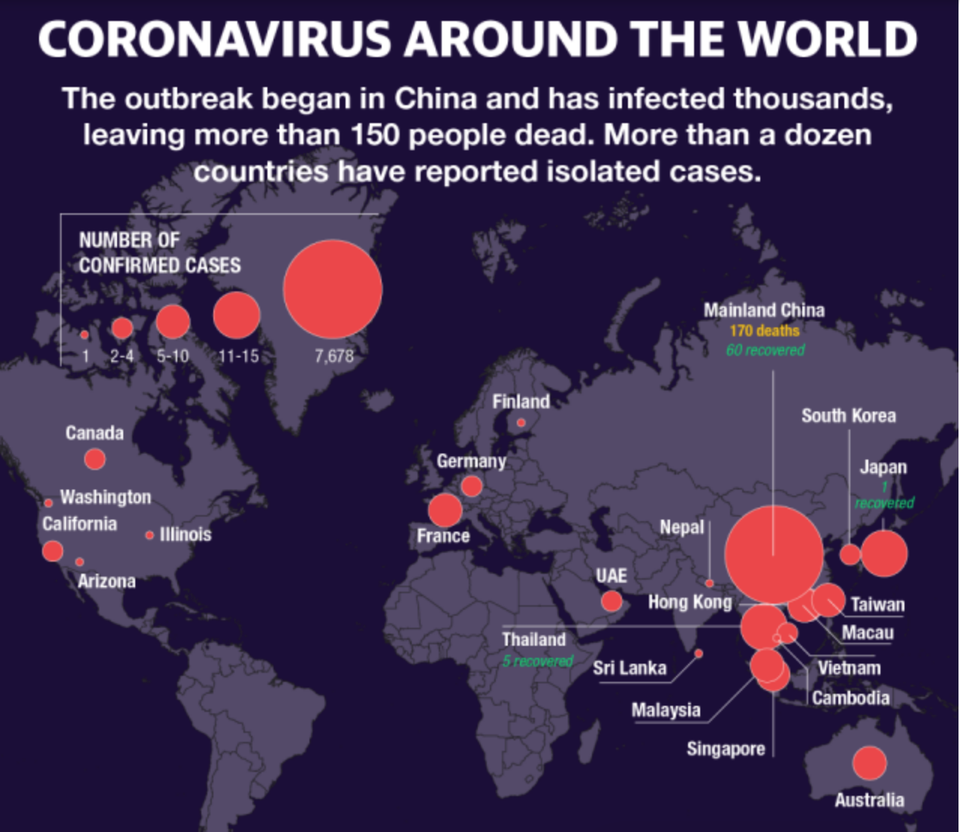
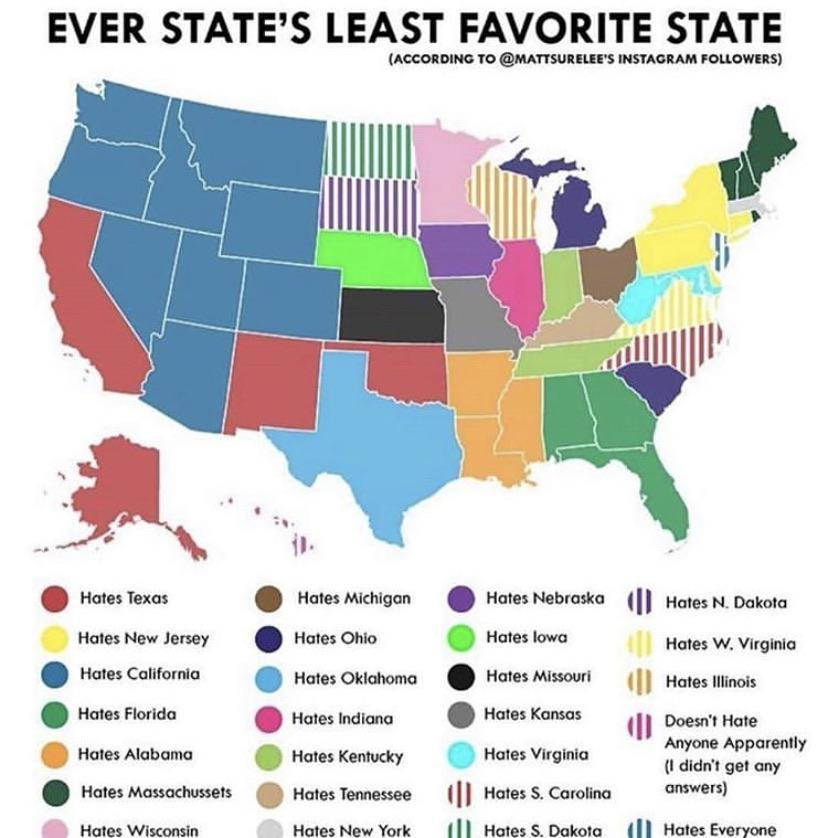
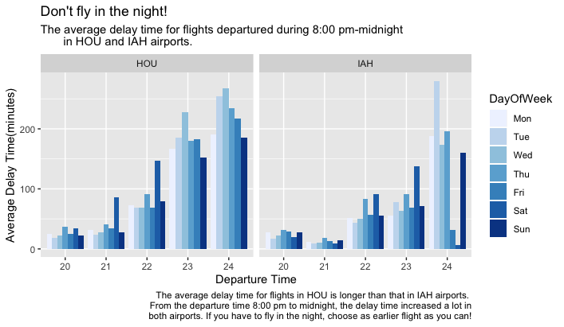

```{r setup, include=FALSE}
knitr::opts_chunk$set(echo = FALSE)
library(knitr)
```

## Visualization 1: Map of Coronavirus

This is a recent visual published on Yahoo depicting the number of cases on Coronovirus around the world.
Here, the number of cases of the virus is indicated by the size of the dot on the map.

```{r, out.width='340px', fig.align='center'}

```

There is a significant **lie factor** in the size aesthetics of the points.
While China has drastically more cases than the United States, the size of the points of the US is fairly close to China's.
At first glance, this might give readers the impression that are more cases worldwide than the data otherwise suggests.

Additionally, there is inconsistency with how many points are present in each country.
While China has one point for the entire country, the US has several points for different cities.
The overall effect of this is **more red dots** on the plot, suggesting again that there are more cases worldwide than the data actually supports.
This gives me the impression that the creator of the plot had a preconceived idea of what story they wanted to tell with the data and manipulated the actual aesthetics and geometries in order to tell it.
I would consider both of the above criticisms as violations of graphical integrity.

I do however appreciate that the plot was trying to capture the geographical incidence of cases using a world map as a backdrop and plotting the points against it.
This important and relevant information for the viewer.
If the scale of the points was changed, I think that there was potential for this to be a good plot with high data ink ratio as I don't believe that there is a lot of "visual junk" as Tufte refers to it.

Source: https://finance.yahoo.com/news/coronavirus-update-us-records-first-humantohuman-transmission-as-china-toll-rises-192436588.html 

## Visualization 2: Map of State Hatred

This second visual is a map of the most hated state in each state in the US.
This visualization was found on Reddit and the data was acquired from the author's Instagram followers, so obviously we shouldn't expect that the data itself should be at all representative of entire states.

```{r, out.width = '300px', fig.align='center'}

```

The author chose to use a chloropleth map with the most hated state as a color aesthetic for each state.
The result however is a lot of **wasted ink**.
The legend of the plot is almost as big as the plot itself and there's no easy way to find what each color corresponds to since some of the colors are so similar to each other.
For example, finding the most hted state of Maine is difficult because the reader has to look at the color of Maine, find it in the legend, and make sure that they are looking for the right shade of green since there are actually four shades of green used in the map.

This brings me to my next point which often gets forgotten when using a color aesthetic.
It is important to remember that many readers cannot distinguish between certain colors and color blind readers should always be taken into consideration.
This plot is difficult enough to navigate as a person with normal eyesight and is likely useless to someone who, for example, cannot differentiate between red and green.

I think some possible tweaks could have been ditching the color labels entirely and instead using the names of the most hated state as labels on the map.
This would be a little confusing to a new reader since they would logically expect a map of the United States to be labeled with the appropriate state name, but I think it has less headache than interpreting all of these colors.
Another alternative is to use a graph representation of this data with edges and nodes and ditch the background map altogether.
I think this is the best option since this plot is intended for an American audience so having all the data on a map which Americans are (hopefully) familiar with already might be redundant information and only adds more wasted ink.
Then each state can be represented as a node with labeled edges directing it towards the state it hates the most.
There are a variety of plotting packages that can visualize networks and graphs so this idea would not be overly complicated to implement, although the data would likely have to wrangled slightly.

## Visualization 3: Air Travel Delay Plots

This is a plot I made as part of a group project.
Here, we are comparing the delay times for flights at two airports in Houston: HOU and IAH.

The plot is faceted by the airport and the x-axis of each plot is the original departure time of the flights.
The y-axis is the average delay time of the flights that fall into those categories.
The days of the week is represented by the color aesthetic which is in an ordered blue palette.

```{r, out.width = '300px', fig.align='center'}

```

This plot does some things well, for example, there is not a lot of **wasted ink** although I think we could likely do without the standard ggplot theme.
It is also easy to compare the overall delay times between HOU and IAH since all the bars are on a common scale.
From this plot, we can see right away that on average, HOU has much longer delays than IAH.
In this way, there is decent **data integrity**.

However, where I think the plot fails is n the comparative aspect of **graphical excellence**: being able to easily compare HOU and IAH on different days.
With all the bars grouped so closely together, we might have been better served be actually faceting by weekday (so we would have 7 smaller plots) and have the color aesthetic be the airports (so each plot would have the same x-axis of departure time but instead of 35 bars in each plot, there would only be 10).

I think this would make the plot overall easier to read.
While I think color aesthetics are an excellent tool when used appropriately, using a seven color palette will always make a plot look busy.
It also doesn't help that the color for Monday is very light and difficult to see on a grey background.
By simplifying the palette so there are only two colors, it will be easier for the reader to interpret quickly.

Also, while the earlier plot was good at showing the overall differences between HOU and IAH, there wasn't an easy way for the eye to pick out particular days with all the bars being displayed.
This is information that the reader would be interested in, since presumably they are looking at this plot to pick out a good day and time to buy a ticket, not just which airport has shorter delays on average.
By faceting on weekday and keeping the information of individual concise, this allows the reader to make these comparisons and contributed to better data excellence.
